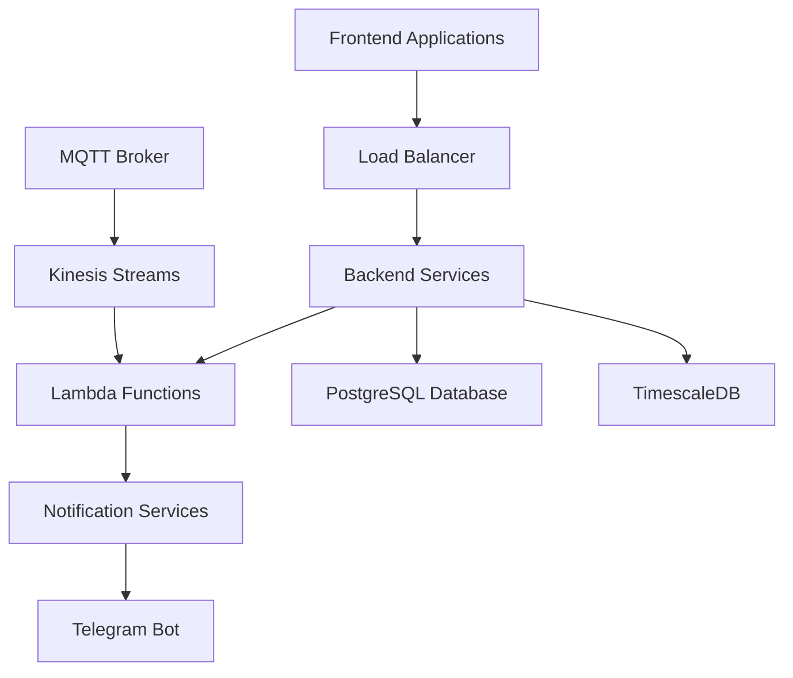

# Backend & Lambda Documentation Hub
![[Iotwatt_logo.png]]
> **Comprehensive documentation for backend systems, lambda functions, and data infrastructure**  
> _Maintained by: IotWatt Development Team_  
> _Last Updated: June 2025_

Welcome to the central hub for all backend and lambda documentation. This knowledge base covers system requirements, data structures, database configurations, lambda implementations, and testing procedures.

---

## 🚀 Quick Navigation

### Core Documentation Sections

- **[[#Requirements]]** - System specifications and feature requirements
- **[[#Data Structures]]** - Data models and asset system architecture
- **[[#Database Systems]]** - PostgreSQL and TimescaleDB configurations
- **[[#Lambda Functions]]** - Serverless function implementations
- **[[#Testing]]** - Testing procedures and reports
- **[[#Daily Operations]]** - Task management and daily logs
- **[[#Notification Services]]** - Communication systems

---

## 📋 Requirements

_System specifications and feature documentation_

- [[Requirements/Demand Control]] - Load management and control systems
- [[Requirements/Watt Report - Optimization]] - Energy optimization reporting
- [[Requirements/MQTT Kinesis]] - Real-time data streaming requirements
- [[Requirements/Device Parameters]] - Device configuration specifications
- [[Requirements/Advanced Asset System]] - Advanced asset management features

---

## 🏗️ Data Structures

_Core data models and system architecture_

- [[Data Structures/Advanced Asset System]] - Asset system data architecture
- [[Data Structures/Asset Types]] - Classification and type definitions

---

## 🗄️ Database Systems

### TimescaleDB

_Time-series database configurations and optimizations_

- [[TimescaleDB/Timezone Views]] - Timezone handling and view configurations
- [[TimescaleDB/Logic for Energy]] - Energy data processing logic

### PostgreSQL

_Relational database setup and extensions_

- [[Postgresql/Database Setup]] - Initial database configuration
- [[Postgresql/Environment Variables]] - Environment configuration management
- [[Postgresql/PG_Cron Extension]] - Scheduled job management
- [[Postgresql/Foreign Data Wrappers (FDW)]] - External data integration

---

## ⚡ Lambda Functions

_Serverless function implementations and configurations_

- [[Lambdas/Demand Control]] - Load control lambda implementation
- [[Lambdas/Device Parameters]] - Device configuration management
- [[Lambdas/Parameter Map]] - Parameter mapping and transformation
- [[Lambdas/Watt Report (Optimization)]] - Energy optimization reporting lambda

---

## 🧪 Testing

_Testing procedures and quality assurance_

- [[Testing/Testing Function]] - Testing framework and methodologies
- [[Testing/Testing Report]] - Test results and analysis

---

## 📅 Daily Operations

_Task management and operational logs_

- [[Daily Tasks/Task Backlog]] - Current task queue and priorities
- [[Daily Tasks/2025-06-05]] - Latest daily log
- [[Daily Tasks/2025-06-04]] - Previous day activities
- [[Daily Tasks/2025-05-29]] - Historical task records

---

## 🔔 Notification Services

_Communication and alerting systems_

- [[Notification Service/Telegram Bot]] - Telegram integration and bot configuration

---

## 🌐 External Resources

### Deployed Applications

- **Production Environment**: [Main Application](https://claude.ai/chat/c4effd38-a9fb-4a89-a8b6-6043ab17e697#) _(Update with actual URL)_
- **Staging Environment**: [Staging Application](https://claude.ai/chat/c4effd38-a9fb-4a89-a8b6-6043ab17e697#) _(Update with actual URL)_
- **Monitoring Dashboard**: [System Monitoring](https://claude.ai/chat/c4effd38-a9fb-4a89-a8b6-6043ab17e697#) _(Update with actual URL)_

### Development Resources

- **Repository**: [GitHub Repository](https://claude.ai/chat/c4effd38-a9fb-4a89-a8b6-6043ab17e697#) _(Update with actual URL)_
- **CI/CD Pipeline**: [Build Status](https://claude.ai/chat/c4effd38-a9fb-4a89-a8b6-6043ab17e697#) _(Update with actual URL)_
- **API Documentation**: [API Docs](https://claude.ai/chat/c4effd38-a9fb-4a89-a8b6-6043ab17e697#) _(Update with actual URL)_

---

## 📊 System Architecture Overview



---

## 🔍 Search and Navigation Tips

### Using Obsidian Features

- **Graph View**: Visualize connections between documentation pages
- **Quick Switcher**: Use `Ctrl+O` (or `Cmd+O` on Mac) to quickly jump to any page
- **Search**: Use `Ctrl+Shift+F` for full-text search across all documentation
- **Backlinks**: Check the backlinks panel to see which pages reference current content

### Tagging System

Use these tags to filter and organize content:

- `#requirement` - Requirements and specifications
- `#implementation` - Code implementations
- `#configuration` - Setup and configuration guides
- `#testing` - Testing-related documentation
- `#daily-log` - Daily task logs
- `#database` - Database-related content

---

## 📝 Contributing Guidelines

### Documentation Standards

- Follow the established folder structure
- Use descriptive titles and clear headings
- Include code examples where applicable
- Update the landing page when adding new sections
- Tag pages appropriately for easier discovery

### Update Process

1. Create or update documentation in the appropriate folder
2. Link to new pages from this landing page
3. Update external links as needed
4. Notify team members of significant changes

---

## 📞 Support and Contact

For questions about this documentation or the systems it describes:

- **Development Team**: [Team Contact](https://claude.ai/chat/c4effd38-a9fb-4a89-a8b6-6043ab17e697#)
- **Documentation Issues**: [Report Issues](https://claude.ai/chat/c4effd38-a9fb-4a89-a8b6-6043ab17e697#)
- **System Status**: [Status Page](https://claude.ai/chat/c4effd38-a9fb-4a89-a8b6-6043ab17e697#)

---

_Last reviewed: June 2025_  
_Documentation version: 1.0_

```
title: "IotWatt Backend & Lambda Documentation Hub"
excerpt: "Comprehensive IotWatt documentation for backend systems, lambda functions, and data infrastructure. Central hub covering system requirements, database configurations, serverless implementations, and testing procedures."
date: "2025-06-05"
author:
	name: "IotWatt Development Team"
ogImage:
	url: "http://dev.iotwatt.io/src/assets/Iotwatt_logo.png"
```